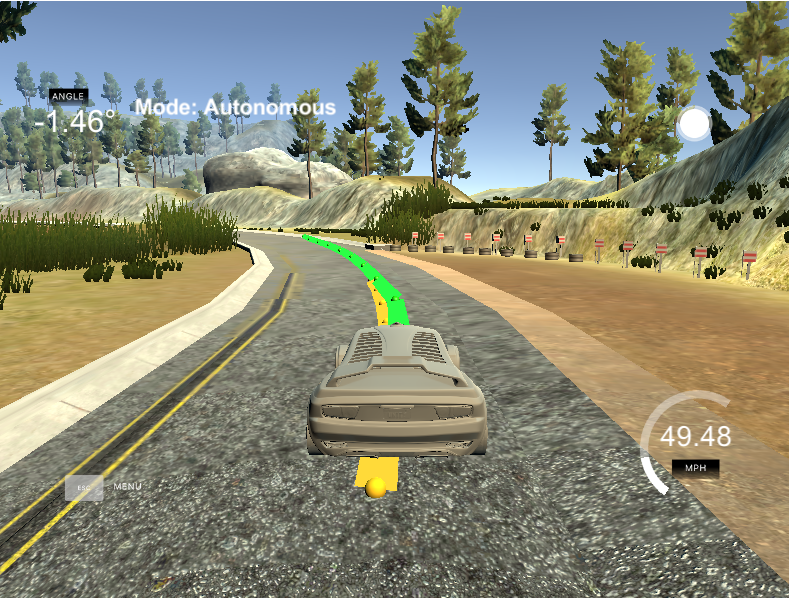

# Model predictive Control

In this project, I implemented an MPC-Controller to steer a car on a track in a simulator. I had to implement the controller as well as tune many parameters.

My submission includes the following files:
- __main.cpp__: Here, I transformed the global coodinates of the waypoints to vehicle coordinates. After fitting a cubic polynomial to the trajectory and esitmating the state with the current control variables, the function MPC.cpp is called that computes the optimal control parameters for the next time step. Also, the resulting coordinates are plotted.
- __MPC.cpp__: This function basically computes the optimal control via optimization by minimizing a cost function that considers errors (such as the cross track error) as well as the smoothness of the control parameters.

The yellow trajectory shows the given waypoints. The green trajectory is the calculated trajectory by the MPC-Controller.

## Implementation

### Model

The idea of an MPC-Controller is as follows. We are given waypoints by some planning procedure (not part of this project) and the goal is to choose values for the actuators such that the car follows the desired trajectory.

In this project, we have two __actuators__, the steering angle and the throttle.

Similiar to the lecture, the __state__ is described by x-coordinates, y-cooridnates, the orientation $\psi$, the velocity v, the cross track error cte, and the orientation error $e\psi$. So, the state is 6-dimensional.

The __update equations__ are as follows:

However, these update equations are in global coordinates. We have to transform them into vehicle coordinates where the car just moves along the x-direction. Thus, the update for the y-coordinate will be 0. Also the initial steering angle in car coordinates is 0.

In total, this leads to the following updates:
$$ \begin{align*}
x & = v \cdot dt \\
y & = 0 \\
\psi &= - \frac{v}{L_f} \cdot \delta \cdot dt \\
v & = v + a \cdot dt \\
cte & = cte + v \cdot \sin(e\psi) \cdot dt \\
e\psi & = e\psi - \frac{v}{L_f} \cdot \delta \cdot dt
\end{align*}$$

The decision the car has to make in each time step is how to choose the actuators, i.e., where to steer and how fast to go. A cubic polynomial is fitted to the way points and a number $N$ of points is chosen equidistantly on this curve with time horizon $T = N \cdot dt$. Now, we use the current state and the update equations to find values for the actuators that minimize a specific cost function.

The main parts of the cost function are the cross track error and the orientation error and we try to minimize both. We use an optimization tool (for nonlinear optimization) that is able to do this while also satisfying constraints (e.g., the update equations are provided via constraints). However, we add some regularization terms to the objective function in order to obtain a nicer driving experience. Therefore, we add the squared actuators and the squared difference of the actuators to obtain slow changes in the variables and smooth driving. I noted that the weighting factors for each part of the objective play a very important role for the car to stay on track.

I ended up with the weight vector $[2000, 2000, 1, 1, 1, 10, 1]$ which penalizes the cte and the $e\psi$ the most. The other parameters are chosen from experiments leading to factors that give a smooth driving experience that is also able to adapt to sharp turns. My reference speed was chosen to be 80.

### N & dt

It is obvious that a large $N$ and a small $dt$ yield the best results. However, the computational power needed increases with increasing $N$ and decreasing $dt$ since the number of variables and constraints of the optimization model also increases.

When increasing the time horizon considered, common sense tells us that at some point there should not be much difference in the performance of our car (Do we really also need to consider the second next curve in order to have a good handling on the next curve?).

For $dt$, I used the values $[0.05, 0.1, 0.2]$ and for $N$, I used the values $[10,20]$. However, I did not do extensive experiments here due to the lack of power of my computer. I ended up using $N = 10$ and $dt = 0.1$ which proved to be sufficient for the task.

### Polynomial Fitting and MPC Preprocessing

Since the state is processed in vehicle coordinates but the waypoints are given in global coordinates, they have to be transformed into vehicle coordinates. This is done with the following transformation:
$$ \begin{align*}
x_{transformed} = (x_{way} - x_{vehicle}) \cdot \cos(\psi) + (y_{way} - y_{vehicle}) \cdot \sin(\psi) \\
y_{transformed} = (y_{way} - y_{vehicle}) \cdot \cos(\psi) - (x_{way} - x_{vehicle}) \cdot \sin(\psi) \end{align*}$$

Then, we fit a cubic polynomial through the transformed coordinates. The preprocessing of the state is described above. The state and the coefficients are given as input to the MPC-Controller.

### Model Predictive Control with Latency

The latency describes the phenomen that a control is not executed immediately but after some time, say 100ms. This is incorporated into the MPC by predicting the state 0.1s in advance and giving this as input to the controller.

## Simulation

The car successfully completes the track. A video can be found [here](./video.mp4 "Project Video").

## Discussion

The computational requirements of this project are quite demanding. Therefore, I had difficulties in debugging my code since compiling took a long time on my microsoft surface.

The MPC-Controller turned out to work very well and the car is able to drive much faster compared to the PID-Controller implemented in the last project.
